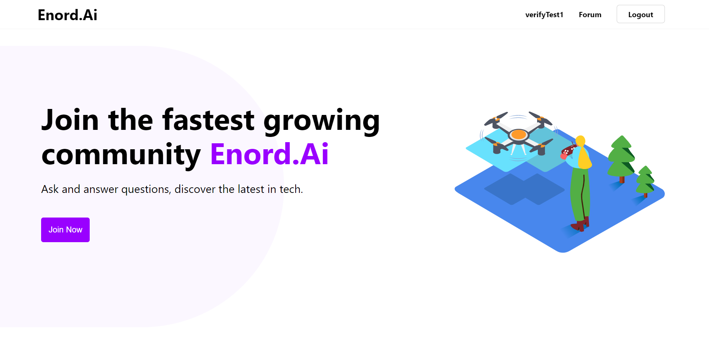
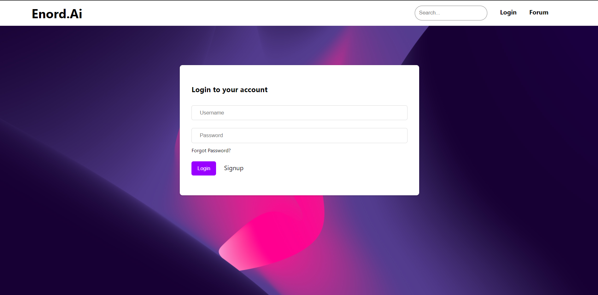
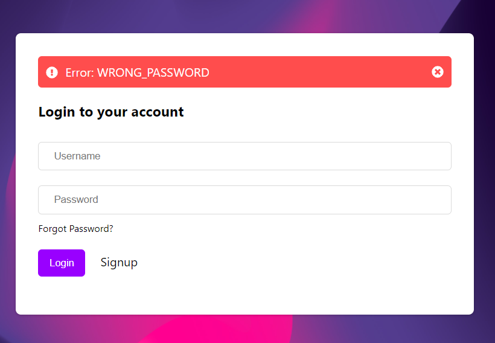
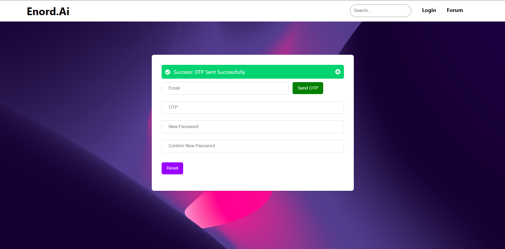
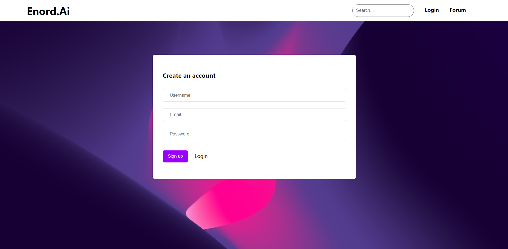
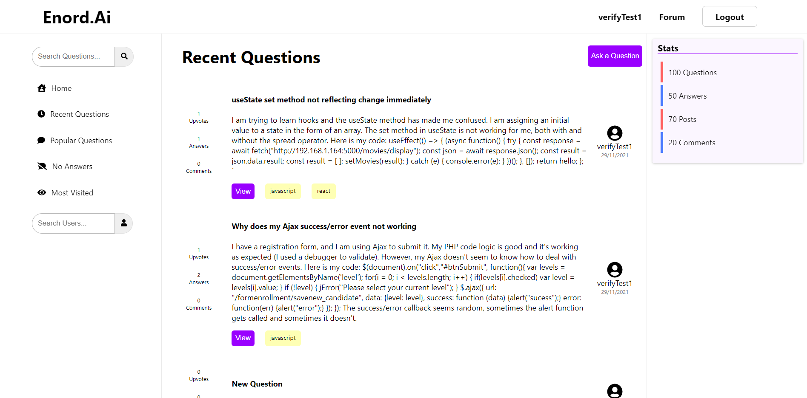
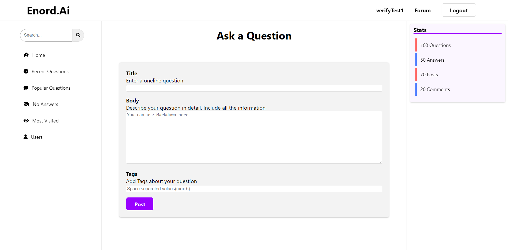
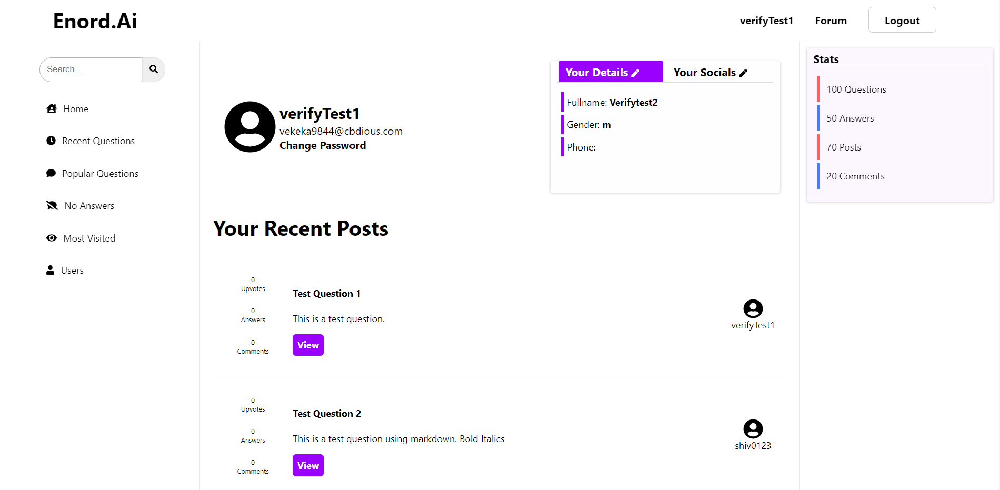
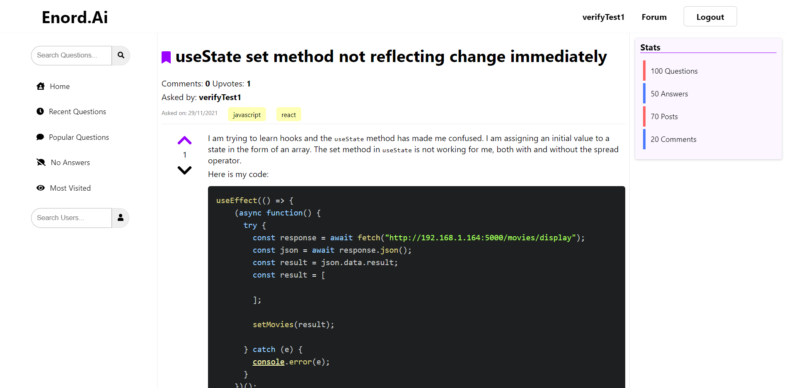
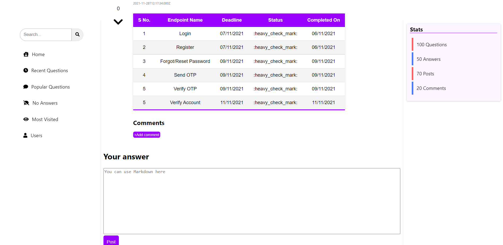

# Frontend  Documentation

## Landing Page

# Login/Signup Page

### Login

1. Username: The username can be the email or the username provided during signup.
2. Forgot Password: If you don’t remember your password then click on this link to send a password reset email.
3. Signup: Link to the signup page.

If any error occurs during login then it will be shown as an alert.

### Forgot Password

To reset your password:

1. Enter your email address and click on `Send OTP`.
2. You will receive a mail which will contain an OTP.
3. Enter the OTP and your new password and click `Reset`.

### Signup

1. Username: 
2. Email: Email length must be less than 320 and must be valid email format. Temporary emails are also not allowed.
3. Password: Password length must be between 8 and 30 characters and must contain at least 1 uppercase letter 1 lowercase letter and 1 number.
4. Login: Link to the Login page.

## Forum Page

This page is accessible only when you are logged in. It contains all the recent posts. To view any question click on the `View` button next below that question. To ask a question click on `Ask a Question` button.

## Ask a Question Page

This page is accessible only if your email has been verified. To verify your email go to your profile page by clicking on your username in the Navbar.

You can use markdown in the body section of the question.

## Profile Page

In this page you can view your profile and change your personal details. You can also change your password here and verify your email.

## Full Post Page

This page shows the full question along with comments and answers. You can bookmark the question, upvote/downvote it , add comments and add a new answer.